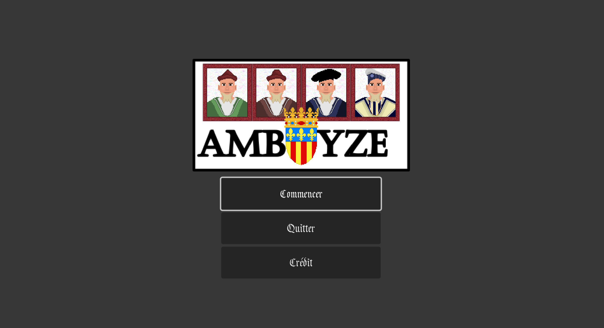
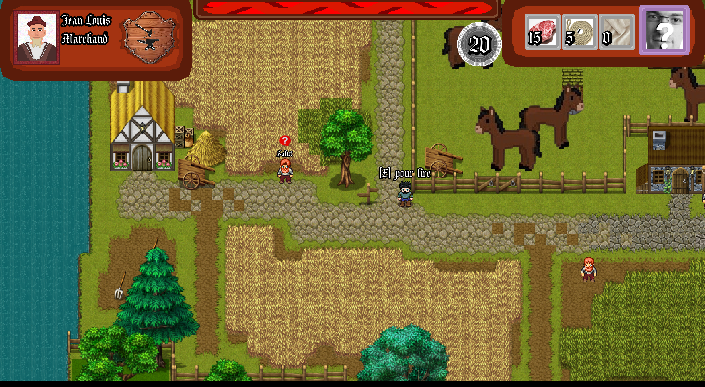
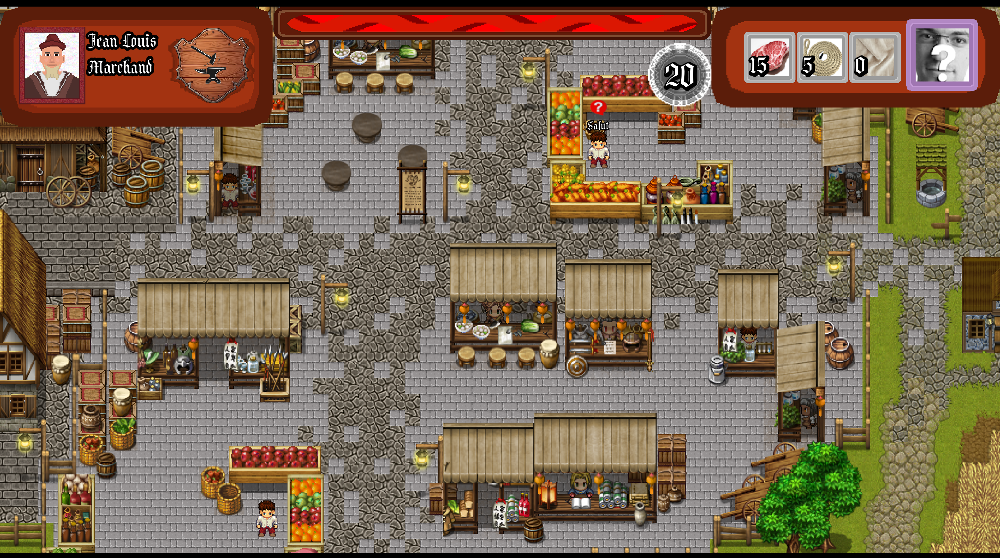

# Amboize
### _T3_

Plongez au cœur de la Renaissance à Amboise, siège du roi de France, dans ce jeu éducatif dans lequel vous pourrez explorer une société où les castes paysannes, marchandes et royales ont chacune leur place.
***Amboize*** offre une plongée immersive dans l'histoire, mêlant éducation et divertissement pour explorer les complexités des relations socio-économiques à une époque importante de l'histoire française.

## Téléchargement

- [Windows][gamedl]

Une fois l'exécutable téléchargé, il suffira de le lancer et le jeu s'éxecutera.
Malheureusement Linux et MacOS ne sont pas supportés pour le moment.

## Documentation

| | |
| ------ | ------ |
| wiki/description | [WIKI.md][wiki] |
| Utiliser Godot | [site officiel de Godot][godot] |

[//]: # (Liens)

   [gamedl]: <Amboise.exe>
   [wiki]: <WIKI.md>
   [godot]: <https://godotengine.org/>
